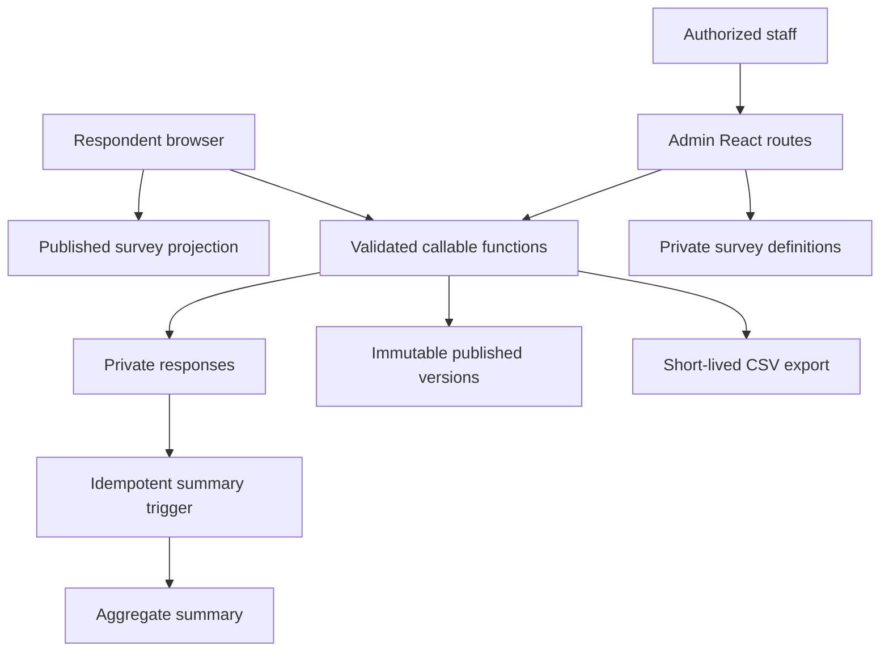

# Architecture decision record

## Decision

Deploy this survey module as an independently deployable React application with its own Firebase project by default. Integrate it into a broader PWA through a narrow route/navigation contract, shared branding inputs, and exports/webhooks—not through direct imports into private internals.

This is appropriate when the survey system may be reused across multiple customer sites or organizations; has its own public traffic, quotas, response data, lifecycle, and deployment cadence; or must be switched off without redeploying a host site.

If it becomes exclusively part of one customer PWA with shared identity, operations, and reporting, the same feature folders can move into that monorepo and share its Firebase project. Do not maintain two databases for the same live response set.

## System shape

## Key boundaries

- `publicSurveys/{publicSurveyId}` is a deliberately small public projection. It contains only the active schema, branding, settings, status, and version.
- Private definitions, memberships, responses, summaries, export jobs, counters, and audit logs live under `organizations/{orgId}`.
- Browsers never write response, publication, counter, role, export, or audit documents directly.
- Shared Zod contracts define callable inputs and public projection shape.
- SurveyJS renders and evaluates conditions on the client; Cloud Functions reload SurveyJS to remove unknown/invalid answer values and enforce visible required questions.
- A deterministic SHA-256 response document ID makes retries idempotent without storing the raw client submission UUID.
- Response capacity is enforced in the same Firestore transaction as the completed response.
- Summary triggers store event receipts so at-least-once delivery does not double-count.

## Alternatives considered

| Option                                    | Decision            | Reason                                                                                                                                                                 |
| ----------------------------------------- | ------------------- | ---------------------------------------------------------------------------------------------------------------------------------------------------------------------- |
| Formbricks self-hosted                    | Inspiration only    | Excellent complete platform, but its current runtime stack is heavier than a focused Firebase module and would not integrate natively with the planned PWA data model. |
| SurveyJS plus direct Firestore writes     | Rejected            | A malicious browser could bypass SurveyJS validation, invent ownership, replay submissions, or mutate counters.                                                        |
| SurveyJS Creator in the initial scaffold  | Deferred            | The runtime Form Library is free; the visual Creator requires a separate license decision.                                                                             |
| One Firebase project per internal feature | Rejected by default | Adds credentials, deployments, billing, monitoring, and cross-project reporting without a real isolation requirement.                                                  |

## Build/runtime choices

- React 19, Vite, TypeScript, React Router
- SurveyJS Form Library only
- Firebase Auth, Firestore, Cloud Functions v2, Storage, Hosting, App Check
- Node.js 22 function runtime
- Zod shared contracts
- Vitest, Firebase Rules Unit Testing, and Playwright

## Change rules

Changing public document fields, callable names, route patterns, response shape, role meanings, or storage paths is a module-contract change. Version the change, provide a migration/rollback path, and update emulator tests before deployment.
